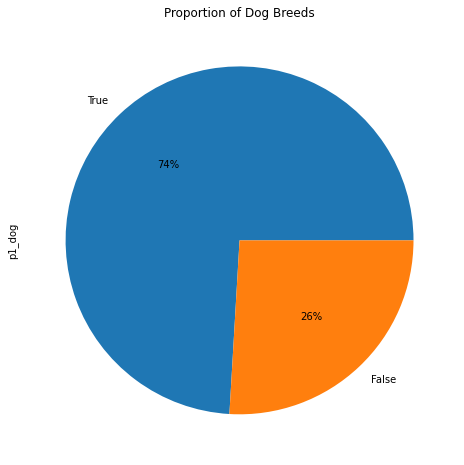
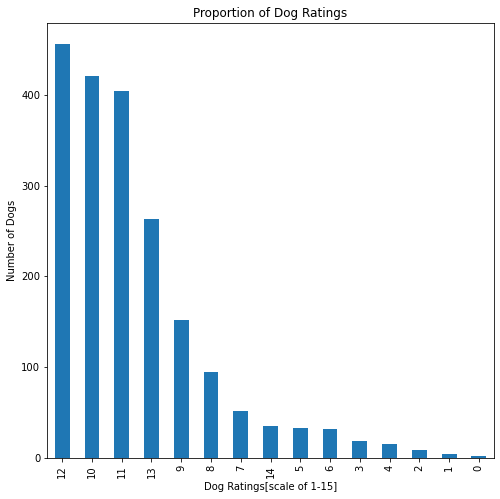

# Wrangle and Analyze Data

### What
Showcase ability to wrangle the twitter archive data of twitter user @dogs_rate  with screen name `WeRateDogs` to create interesting and trustworthy analyses and visualizations

### Why
The Wrangle and Analyze data project is aimed at demonstrating the capabilities of the student to gather data from different sources, wrangle data, analyze data and create insights and great visualizations from these data.

### How
I gathered three datasets from three different data sources and worked with three different types of files – manually downloading a [csv file](https://d17h27t6h515a5.cloudfront.net/topher/2017/August/59a4e958_twitter-archive-enhanced/twitter-archive-enhanced.csv), getting additional information from a [URL](https://d17h27t6h515a5.cloudfront.net/topher/2017/August/599fd2ad_image-predictions/image-predictions.tsv) using the request library and save into a tsv file, and lastly using the twitter API `tweepy` to extract some more information about the data from twitter into a [JSON file](./tweet_json.txt). All three files were used to create three separate datasets with data from the tweet archive of twitter user @dog_rates, also known as WeRateDogs.

## Table of contents

- [Overview](#overview)
  - [The challenge](#the-challenge)
  - [Outcome](#outcome)
  - [Links](#links)
  - [Built with](#built-with)
  - [What was learnt](#what-was-learnt)
  - [Continued development](#continued-development)
  - [Useful resources](#useful-resources)
- [Acknowledgments](#acknowledgments)

## Overview
This project which is known as wrangle and analyze data involves the wrangling of WeRateDogs twitter archive data from the period of 2015 to 2017. The twitter archive data was made available to Udacity by the twitter user was used for the purpose of this project’s objective. See archive [here]( https://d17h27t6h515a5.cloudfront.net/topher/2017/August/59a4e958_twitter-archive-enhanced/twitter-archive-enhanced.csv ).

### The challenge 
The goal of this project is to wrangle WeRateDogs twitter data to create interesting and trustworthy analyses and visualizations. The twitter data however contains very basic information. Therefore, gathering of additional data was carried out using twitter API and image prediction data was also collected [here](https://d17h27t6h515a5.cloudfront.net/topher/2017/August/599fd2ad_image-predictions/image-predictions.tsv) prior to  cleaning and assessing of the data.

### Outcome
Following the cleaning, assessment, and analysis of all the data collected from the different sources, some insights were garnered, and appropriate visualizations produced to showcase these insights.

The following questions formed the basis our analysis:

- How many tweet images corresponds to a breed of dog, and how many were not dog images?

- What is the proportion of dog ratings across the different dog images reviewed?

- Which day of the year and month within the period had the highest amount of likes and retweets.

In answering the first question, we gathered that out of a total of 1994 rows of dog image prediction data analyzed, only 1477 were images of dog breeds while 517 were not even dog breeds. Meaning that of all images posted within the period of November 2015 to August 2017, only 74% of all images posted for ratings on WeRateDogs twitter page were actual pictures of dogs while 26% were not even pictures of dogs.

We also gathered that within that same period as earlier highlighted, only images of 374 dog breeds have been rated on WeRateDogs twitter timeline out of a total of 1477 dog images data assessed. 12/10 was observed to be the highest proportion of rating given on WeRateDogs twitter page with a mean dog rating of 10/10. The lowest dog rating however was 0 as clearly shown in the chart below. Only 35 dog images have received a rating of 14 which was the highest rating ever given within the period.
_P.S: Note that this data does not include images that were not dog breeds_.

Lastly, we were also able to gather from our analysis that within the period in question - November 2015 - August 2017, the tweet with the highest retweet count and favorite count(likes) was tweeted on the 18th of June 2016 at 7.26pm from an iPhone with a test “**Here's a doggo realizing you can stand in a pool. 13/10 enlightened af (vid by Tina Conrad)**" and tweet [URL]( https://twitter.com/dog_rates/status/744234799360020481/) with 70,331 retweets and 144,247 likes on that particular tweet.

### Links

#### Solution URL: 

- [HTML](./wrangle_act.html)

- [Jupyter notebook](./wrangle_act.ipynb)

### Built with

- Jupyter Notebook
- Python
- Pandas, Numpy, requests, tweepy , json, Image, BytesIO libraries.

### What was learnt

The skills and ability to gather and collect data from different sources such as via URL, twitter API, data scraping etc. Also ability to carry out a data assessment both visually and programmatically, data cleaning and wrangling on a dataset with a wide range of data quality and tidiness issues, gain insights from data by performing analyses of the data, storing data in a database or csv format, and creating great and effective visualizations from your data to showcase findings and insights.

### Continued development

There is always room for more learning in the areas of data wrangling, assessing and documenting issues related to a dataset and reporting of findings. Visualization is also another area where additional knowledge would be acquired via platforms such as tableau and python visualizations using seaborn and matplotlib libraries.

### Useful resources

- [Pandas Documentation](https://pandas.pydata.org/pandas-docs/stable/reference/frame.html) - This course is great to learn and master javascript with practical hands-on experience to test your learning as you go
- [Stack Overflow](https://stackoverflow.com/questions/25646200/python-convert-timedelta-to-int-in-a-dataframe) - A useful platform  to search for possible answers to questions.
- [Tweepy Documentation](https://docs.tweepy.org/en/stable/) - Documentation to understand how to use the twitter API library tweepy.
- [How to Get a twitter Developer Account and API keys - A beginners guide](https://medium.com/@Nonso_Analytics/how-to-get-a-twitter-developer-account-and-api-key-a-beginners-guide-1c5c18765a9d) - This medium article would help any interested student or developer get access to the twitter API.
- [Twitter archive of WeRateDogs 2005-2007](https://d17h27t6h515a5.cloudfront.net/topher/2017/August/59a4e958_twitter-archive-enhanced/twitter-archive-enhanced.csv) - Twitter archive of the first dataset used for this project.
- [Image prediction data WeRateDogs 2005-2007](https://d17h27t6h515a5.cloudfront.net/topher/2017/August/599fd2ad_image-predictions/image-predictions.tsv) - Twitter archive of the image prediction data used for this project.

## Acknowledgments
Special thanks to ALX - T and the entire ALG/ALX team and their sponsors for the sponsorship of this program and giving me the opportunity to be a beneficiary of the Udacity data analysis nanodegree program. Also special thanks to my session lead whose weekly sessions has helped to make my learning more easier and better. And also to my colleagues for their support and encouragement.